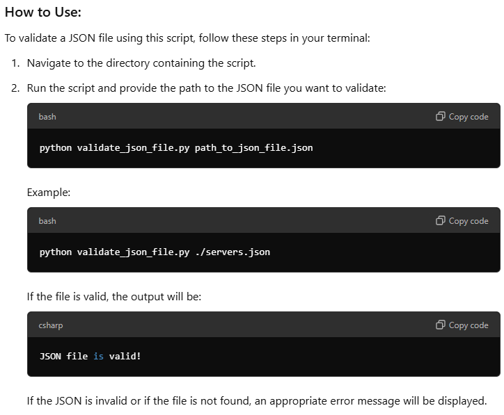

# JSON
## What is JSON?
* JSON is text, written with JavaScript object notation.
* Python has a built-in package called json, which can be used to work with JSON data.
* A popular, open standard file format for storing and exchanging data.

## What does it stand for?
* JavaScript Object Notation. 

## What is it used for?
* For transmitting data in web applications (e.g., sending some data from the server to the client, so it can be displayed on a web page, or vice versa).
* It’s used to represent data structures and objects.

## What is it written in?
* The JSON syntax is derived from JavaScript object notation syntax, but the JSON format is `text only`. 
* Code for reading and generating JSON data can be written in any programming language.

## Include a simple example of JSON
* a JSON object with key-value pairs, such as:
```python
{ "first_name" : "Sammy", "last_name" : "Shark", "location" : "Ocean", "online" : true, "followers" : 987 } 
```
## Advantages of using it?
* **Flexibility**: can support a wide range of data types.
* **Easy**: easy to use and understand, doesn't require additional code to interpret data. 
  * Easy for machines to understand it and regenerate it into other formats. 
* **Support**: JSON is supported by most programming languages, operating systems and browsers.
* **Self-describing**: easy to distinguish between data types and interpret data without prior knowledge.

## What data types can it store/use?
* string : number : JSON object : array : boolean : null.
* It CAN'T store: a function : a date : undefined. 

## What is the JSON syntax for:
* Used to structure data in a text-based format that is both human-readable and machine-parsable.

### Name value pairs?
* In JSON, data is written as name/value pairs. 
* A name/value pair consists of a field name (in double quotes), followed by a colon, followed by a value.
```python
"name": "John"
```
### Objects?
* JSON objects are collections of name/value pairs enclosed in curly braces {}. 
* Each name/value pair is separated by a comma. 
```python
{
  "name": "John",
  "age": 30,
  "city": "New York"
}
```

### How to separate data (key/value pairs) from one another
* Key/value pairs are separated by commas. 
```python
{
  "name": "John",
  "age": 30,
  "city": "New York"
}
```

### JSON arrays (these are like lists in python)
* JSON arrays are ordered collections of values enclosed in square brackets []. 
* These values can be strings, numbers, objects, arrays, booleans, or null. 

```python
{
  "names": ["John", "Jane", "Doe"],
  "ages": [30, 25, 22]
}
```

## How to convert a JSON file to python
1. Import the json module: This module is part of the Python standard library, so no installation is required. 
2. Open the JSON file: Use Python's built-in open() function to open the file in read mode. 
3. Load the JSON data: Use the json.load() function to convert the JSON data into a Python object.

```python
# How to convert JSON to a Python dict.

import json

# Open and load the JSON file
with open('data.json', 'r') as file:
    data = json.load(file)

# Now `data` is a Python dictionary
print(data)
```
### Explanation:
* `open('data.json', 'r')`: Opens the data.json file in read mode ('r'). 
* `json.load(file)`: Converts the contents of the JSON file into a Python dictionary. 
* `with`: Ensures the file is properly closed after the reading is done.

### Working with a JSON file and processing it in the following steps:
1. import json. 
   * The json module is imported to allow Python to work with JSON (JavaScript Object Notation) data. JSON is a popular format for storing and exchanging data between systems.
2. Open and read 'r' the JSON file.
   * This opens the file servers.json (located in the json_yaml directory) in read mode ('r'). 
   * The with statement ensures the file is automatically closed when the block of code is done, even if an error occurs.
   * The json.load() function reads the contents of the opened file (json_file), which is expected to be in JSON format, and converts it into a Python dictionary. 
   * The result is stored in the variable servers.
3. Print the Type of servers.
   * This line prints the data type of the servers variable. 
   * Since the JSON data is converted into a Python dictionary, it should output <class 'dict'>.
4. Access and Print Values of server1 and server2.
   * The dictionary servers has keys like server1 and server2. These lines access and print the values (which are also dictionaries) associated with these keys.
5. Iterate Over All Keys and Values.
   * This loop goes through each key-value pair in the servers dictionary. 
   * For each key (like server1, server2), it prints the key and its corresponding value (which is itself another dictionary).
6. Iterate Over Nested Dictionaries.
   * Inside the main loop, this nested loop iterates over the key-value pairs inside each value (which are dictionaries, representing the properties of each server). 
   * For example, if the value of server1 is {"name": "Server1", "status": "active"}, this loop will print each key (name, status) and its value (Server1, active).
Summary:
* The code loads and reads a JSON file (servers.json), converts it into a Python dictionary, and iterates through the data, printing the top-level and nested keys and values.

```python
# Parsing a json file to dict.

import json  # Imports the json module, which allows us to work with JSON data in Python.

# Open and read the JSON file
with open('json_yaml/servers.json', 'r') as json_file:  # Opens the file 'servers.json' in read mode ('r').
    servers = json.load(json_file)  # Reads the JSON data and converts it into a Python dictionary, stored in `servers`.

# Print the type of the `servers` variable
print(f'Type of servers: {type(servers)}')  # Prints the data type of `servers`, which will be a dictionary (<class 'dict'>).

# Access and print the values for keys 'server1' and 'server2'
print(f'server1: {servers["server1"]}')  # Accesses and prints the data for 'server1' from the dictionary.
print(f'server2: {servers["server2"]}')  # Accesses and prints the data for 'server2' from the dictionary.

# Iterate through all keys and values in the `servers` dictionary
for key, value in servers.items():  # Loops through each key-value pair in the `servers` dictionary.
    print(f"Key and value: '{key}' = '{value}'")  # Prints each key (e.g., 'server1') and its associated dictionary.

    # For each server's details, loop through its nested dictionary of properties
    for sub_key, sub_value in value.items():  # Loops through the inner dictionary (e.g., name, status of each server).
        print(f"  Record key and sub value: '{sub_key}' = '{sub_value}'")  # Prints each key-value pair of the server's properties.

```
### SUMMARY: encoding_serialisation.py
* This code creates a dictionary (person), then converts it into a JSON-formatted string, and writes it to a file (person.json). The file will contain a JSON representation of the person dictionary.

```python
# encoding_serialising.py

import json     # import json imports Python's built-in json module, which provides functions to work with JSON data (converting between JSON and Python objects).

person = {      # A dictionary named person is created, representing information about an individual. This dictionary has four keys
    'name' : 'Carol',
    'age' : 43,
    'weight' : 160,
    'dogs' : ['Mr. Barks', 'Rufus']
}

with open('/person.json', 'w') as output:      # opens a file named person.json in write mode ('w'). The with statement ensures the file is automatically closed after the block of code completes.
    json.dump(person, output)           #  converts the person dictionary into a JSON format and writes it to the person.json file.
```

## A script that converts Valid JSON to Valid YAML
```python
import json
import os
import sys
import yaml

# Check if the correct number of command-line arguments are passed (should be 3: script name, source file, target file)
if len(sys.argv) != 3:
    print("ERROR: Incorrect number of arguments")
    print("Usage: json2yaml.py <source_file.json> <target_file.yaml>")
    exit(1)

# Extract the source and target file paths from the command-line arguments
source_file_path = sys.argv[1]
target_file_path = sys.argv[2]

# Check if the source JSON file exists in the specified path
if not os.path.exists(source_file_path):
    print(f"ERROR: {source_file_path} not found")  # Show an error if the file does not exist
    exit(1)

try:
    # Open and read the JSON file
    with open(source_file_path, 'r') as source_file:
        source_content = json.load(source_file)  # Load JSON content into a Python dictionary

    # Convert the JSON content (Python dictionary) to YAML format and write to the target file
    with open(target_file_path, 'w') as target_file:
        # Write YAML content with human-friendly formatting (no flow style and no automatic key sorting)
        yaml.dump(source_content, target_file, default_flow_style=False, sort_keys=False)
    
    print(f"Successfully converted {source_file_path} to {target_file_path}")  # Confirmation message upon success

except Exception as e:
    # If any error occurs (e.g., file access issues, JSON parsing errors), show an error message with details
    print(f"An error occurred: {e}")
    exit(1)
```
## Explanation of the Code:
1. Imports:
   * `json`: Used to read the JSON data from the input file.
   * `os`: Helps check if the specified file exists.
   * `sys`: Used to read command-line arguments.
   * `yaml`: A Python library for working with YAML files. In this case, it converts JSON data to YAML.

2. Argument Check:
   * The script expects two command-line arguments (besides the script itself): the source JSON file and the target YAML file.
   * If the number of arguments is incorrect, the script prints an error message and exits.

3. File Existence Check:
   * Before processing the source JSON file, the script checks if the file exists at the provided path. If it doesn't, an error is printed, and the script exits.

4. JSON to YAML Conversion:
* The script opens the JSON file, reads its contents, and parses it into a Python dictionary using `json.load()`.
* The dictionary is then converted to YAML using `yaml.dump()`. The parameters `default_flow_style=False` ensure that the output uses block-style formatting (which is more human-readable), and `sort_keys=False` ensures that the keys maintain their original order.

5. Error Handling:
* If any error occurs during file reading, writing, or data conversion (like invalid JSON format), the exception is caught, and a corresponding error message is printed.

## Validate JSON file
```python
import json  # Import the JSON module to work with JSON data
import os    # Import os to check for file existence
import sys   # Import sys to work with command-line arguments
import yaml  # Import YAML module (not used in validation but may be useful later)

# Ensure that a file is passed as a command-line argument
# sys.argv[0] is the script name, sys.argv[1] should be the JSON file
if len(sys.argv) > 1:  # Check if more than one argument is provided
    # Check if the specified file exists in the system
    if os.path.exists(sys.argv[1]):
        # If the file exists, attempt to open it
        with open(sys.argv[1], "r") as file:
            try:
                # Try to load the file as JSON - this is where validation happens
                json.load(file)
                print("JSON file is valid!")  # If no exception is raised, the JSON is valid
            except json.JSONDecodeError as e:  # Handle invalid JSON format
                print(f"Invalid JSON file: {e}")
    else:
        # If the file does not exist, inform the user
        print(f"ERROR: File '{sys.argv[1]}' not found")
else:
    # If no arguments are passed, inform the user that they must provide a file
    print("ERROR: No JSON file was specified to check")
    print(f"Usage: {sys.argv[0]} <JSON filename>")  # Provide usage instructions
```

### Step-by-Step Explanation:
1. Import Modules:
* `json`: To load and validate the JSON file. 
* `os`: To check if the file exists. 
* `sys`: To handle command-line arguments. 
* `yaml`: Although it's imported here, it's not required for validating JSON in this particular script.

2. Command-Line Argument Check:
* `sys.argv[0]`: Refers to the script name (`validate_json_file.py`).
* `sys.argv[1]`: Refers to the JSON file passed as an argument.
* The script checks if the length of `sys.argv` is greater than 1 (i.e., the user has passed a JSON file after the script name). If not, it prints an error message explaining the correct usage.

3. File Existence Check:
* `os.path.exists(sys.argv[1])`: Ensures that the JSON file exists. If it doesn't, an error message is printed, and the script exits.

4. Opening and Validating the JSON File:
* The script attempts to open the specified file using a `with` statement, ensuring the file is properly closed afterward.
* Inside the `with` block, `json.load(file)` is called to load and parse the JSON data. This also implicitly validates the JSON format. If the JSON file is invalid, it will raise a `json.JSONDecodeError`.

5. Handling Invalid JSON:
* If the JSON file is invalid (e.g., missing braces, commas, etc.), the `json.JSONDecodeError` is caught, and the error is printed with a message showing where the error occurred.

6. Success Message:
* If the JSON file is successfully loaded and parsed, the script prints "JSON file is valid!" indicating that the file is correctly formatted.

7. Error Messages:
* If the file does not exist, or no file is provided, appropriate error messages are printed with instructions on how to use the script.

 


